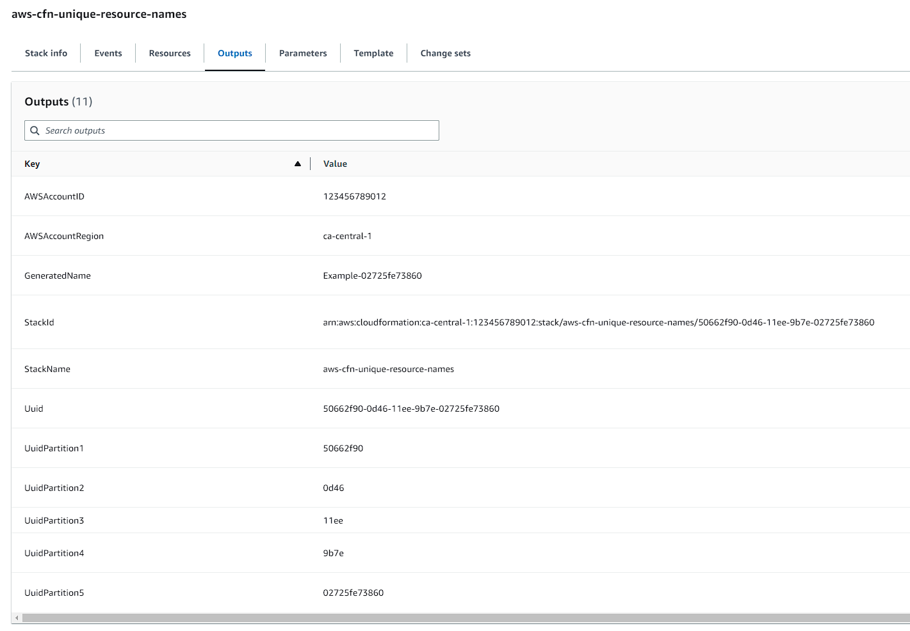
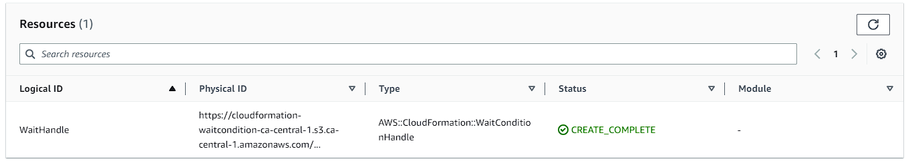

# Notes

## Why use a randomized name if passing a parameter

In many cases it won't be necessary to have an override parameter, either for the name or the source of uniqueness (i.e. `AWS::StackId`) as it isn't needed. The case of migrating resources between stacks is typically rare, or it is acceptable to destroy & re-create the resources in a new stack. The name parameter override was provided as an example for cases in which you might want the default behaviour to be a unique value, with a "vanity/flavour" name as the override case.

An example that this often comes up with is for domain names, in which the default "sandbox/staging" behaviour would be a random fully qualified domain name (FQDN) such as `02bec084ce62.internal.aeydr.dev`, but in a production capacity it would use a fixed name (i.e. `service.aeydr.dev`).

## Why use a `WaitConditionHandle`

A `WaitConditionHandle` was chosen over a common resource type like [AWS::IAM::Role](https://docs.aws.amazon.com/AWSCloudFormation/latest/UserGuide/aws-resource-iam-role.html) because the CloudFormation Template is solely focused on the internals of Cloudformation. Using a `WaitConditionHandle` does introduce complexity because it doesn't support an `update` action, which is why the repository generates a random logical ID suffix for this `WaitConditionHandle` to force updates. Using a resource like [AWS::IAM::Role](https://docs.aws.amazon.com/AWSCloudFormation/latest/UserGuide/aws-resource-iam-role.html) has the potential to avoid that, but ultiamtely means introducing another Amazon Web Service (AWS) service like IAM into the mix.

## Why randomize the `WaitConditionHandle` logical ID

The logical ID for this needs to be randomized to ensure that each deployment of the CloudFormation stack will cause an update operation. Otherwise CloudFormation will not trigger updates on non-resource changes. That means that if just the `Parameters` and `Outputs` are changing, CloudFormation will not trigger an update.

You can learn a bit on this from [Amazon CloudFormation stack updates](https://docs.amazonaws.cn/en_us/AWSCloudFormation/latest/UserGuide/using-cfn-updating-stacks.html) or [How does Amazon CloudFormation work?](https://docs.amazonaws.cn/en_us/AWSCloudFormation/latest/UserGuide/cfn-whatis-howdoesitwork.html).

## Why handcraft the templates

The templates in this repository are handcrafted instead of being generated by something like [AWS CDK](https://aws.amazon.com/cdk/) (or cloudformation spec libraries like [cloudtools/troposphere](https://github.com/cloudtools/troposphere)), as this was intended to focus more on the underlying capabilities of CloudFormation, rather than the interface you might work with for ultimately generating the CloudFormation templates.

As an example, when constructing these name helpers within AWS CDK, you might want to support a utility for generating unique names, or encode it baseline into prebuilt patterns. This kind of design decision wasn't the focus on this repository/article, so the templates became handcrafted.
