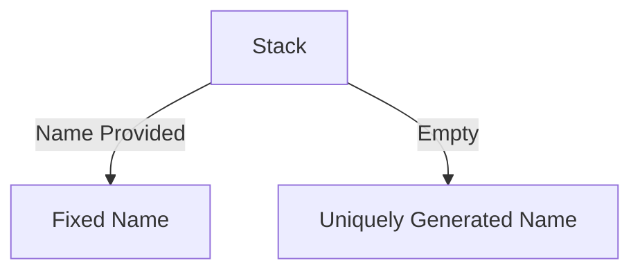

# AWS CloudFormation Unique Resource Names

This is a companion repository for the written article 'AWS CloudFormation Unique Resource names with built-in functions', which demonstrates examples of CloudFormation Templates which generated unique names for resources, which are computed using the predefined pseudo parameters reference. These CloudFormation Templates are handwritten, but in practice would rely on frameworks such as AWS Cloud Development Kit (CDK) to construct the templates. A library would address concerns about re-usability of the unpacking of the predefined pseudo parameters such as `AWS::StackId`.

## Getting Started

For working with the repository, you will need an [Amazon Web Services (AWS)](https://aws.amazon.com/) account, for which the permissions are sufficient to provision and destroy CloudFormation Stacks. For simplicity, a [gitpod](../.gitpod) environment is included with the repository, should you be familiar with Cloud Development Environments (CDEs).

If you are working locally, you will need to ensure that the following tools are installed:

- [make](https://www.gnu.org/software/make/)
- [awscli](https://aws.amazon.com/cli/)

This repository uses `make` as a task runner & interface for the CloudFormation commands. It is recommended when entering the repository within the Development Environment to run `make help` to see a list of available commands, and the related documentation.

> `make help` is only accessible from within the [development environment](../.gitpod), as it is imported from the `GLOBAL_MAKEFILE_LIBRARY`.

## Deploying into CloudFormation

> Before starting you should make sure you have authenticated to AWS with the [awscli](https://docs.aws.amazon.com/cli/latest/userguide/cli-chap-configure.html)

To initialize an empty CloudFormation Stack that creates no resources, you can run the make command `cfn-init`. This will deploy into CloudFormation a stack that uses a `WaitConditionHandle` as the sole resource. You can run this as follows:

```bash
make cfn-init
```

This will construct a stack with the name `aws-cfn-unique-resource-names`, as seen in the command logs:

```text

Waiting for changeset to be created..
Waiting for stack create/update to complete
Successfully created/updated stack - aws-cfn-unique-resource-names
```

> You can modify the CloudFormation stack name using the `STACK_NAME` variable

The CloudFormation template that has been deployed is located at [cloudformation/01-empty/stack.template.yaml](../cloudformation/01-empty/stack.template.yaml), which contains just metadata and the `WaitConditionHandle`. The [WaitConditionHandle](https://docs.aws.amazon.com/AWSCloudFormation/latest/UserGuide/aws-properties-waitconditionhandle.html) resource is necessary as a CloudFormation stack cannot be created without resources, and a `WaitConditionHandle` is an internal stack resource that doesn't require us to provision anything within AWS. Provisioning this allows us to get a working CloudFormation Stack without needing to worry about troubleshooting a failed stack create.

With the stack created, you can now deploy the CloudFormation template that defines as outputs some of the [pseudo predefined cloudformation variables](https://docs.aws.amazon.com/AWSCloudFormation/latest/UserGuide/pseudo-parameter-reference.html#cfn-pseudo-param-stackid) as a [CloudFormation stack](../cloudformation/02-properties/stack.template.yaml). You can do this as follows:

```bash
make cfn-props
```

This will deploy the cloudformation template, with the set of outputs containing values such as the current AWS Account, StackId (in the form of an arn), and the composition of the StackId as separate output fields. These values can be seen within the AWS Console, or visible when describing the CloudFormation stack. The logs from provisioning this updated template should be as follows:

```text

Waiting for changeset to be created..
Waiting for stack create/update to complete
Successfully created/updated stack - aws-cfn-unique-resource-names
```

To describe the current stack, along with all of the output values for the Stack, you can run the following command:

```bash
make cfn-describe
```

This will yield the CloudFormation stack, described in the tabular format below:

```text
-------------------------------------------------------------------------------------------------------------------------------------------------------------------------------------------------------------------------------------------------------------------------------------------------------------------------
|                                                                                                                                                    DescribeStacks                                                                                                                                                     |
+-----------------------------------------------------------------------------------------------------------------------------------------------------------------------------------------------------------------------------------------------------------------------------------------------------------------------+
||                                                                                                                                                       Stacks                                                                                                                                                        ||
|+----------------------------------------------------+----------------------------------------------------------------------------------------------------------------------------------------------------------------------------------------------------------------------------------------------------------------+|
||  ChangeSetId                                       |  arn:aws:cloudformation:ca-central-1:123456789012:changeSet/awscli-cloudformation-package-deploy-1686356733/52dadf94-7e3a-4dca-aae3-209e7f9db03b                                                                                                               ||
||  CreationTime                                      |  2023-06-09T23:55:35.009000+00:00                                                                                                                                                                                                                              ||
||  Description                                       |  A list of pseudo predefined parameters within a CloudFormation stack                                                                                                                                                                                          ||
||  DisableRollback                                   |  False                                                                                                                                                                                                                                                         ||
||  EnableTerminationProtection                       |  False                                                                                                                                                                                                                                                         ||
||  LastUpdatedTime                                   |  2023-06-10T00:25:39.255000+00:00                                                                                                                                                                                                                              ||
||  StackId                                           |  arn:aws:cloudformation:ca-central-1:123456789012:stack/aws-cfn-unique-resource-names/201c12d0-0721-11ee-b056-02bec084ce62                                                                                                                                     ||
||  StackName                                         |  aws-cfn-unique-resource-names                                                                                                                                                                                                                                 ||
||  StackStatus                                       |  UPDATE_COMPLETE                                                                                                                                                                                                                                               ||
|+----------------------------------------------------+----------------------------------------------------------------------------------------------------------------------------------------------------------------------------------------------------------------------------------------------------------------+|
|||                                                                                                                                                 DriftInformation                                                                                                                                                  |||
||+-------------------------------------------------------------------------------------------------------------------------------------------------------------------------------+-----------------------------------------------------------------------------------------------------------------------------------+||
|||  StackDriftStatus                                                                                                                                                             |  NOT_CHECKED                                                                                                                      |||
||+-------------------------------------------------------------------------------------------------------------------------------------------------------------------------------+-----------------------------------------------------------------------------------------------------------------------------------+||
|||                                                                                                                                                      Outputs                                                                                                                                                      |||
||+-----------------------------------------------------------------------------------------------------------------------------------------------------------------+-------------------+-----------------------------------------------------------------------------------------------------------------------------+||
|||                                                                           Description                                                                           |     OutputKey     |                                                         OutputValue                                                         |||
||+-----------------------------------------------------------------------------------------------------------------------------------------------------------------+-------------------+-----------------------------------------------------------------------------------------------------------------------------+||
|||  Returns the second partition of the Uuid for the stack, such as 2ba7.                                                                                          |  UuidPartition2   |  0721                                                                                                                       |||
|||  Returns the first partition of the Uuid for the stack, such as f0228ab2.                                                                                       |  UuidPartition1   |  201c12d0                                                                                                                   |||
|||  A _unique_ resource name generated from the StackId's fourth partition                                                                                         |  GeneratedName    |  Example-02bec084ce62                                                                                                       |||
|||  Returns the Uuid of the stack, such as f0228ab2-2ba7-47bd-9d19-65c12972248e.                                                                                   |  Uuid             |  201c12d0-0721-11ee-b056-02bec084ce62                                                                                       |||
|||  Returns the AWS account ID of the account in which the stack is being created, such as 123456789012.                                                           |  AWSAccountID     |  123456789012                                                                                                               |||
|||  Returns the fifth partition of the Uuid for the stack, such as 65c12972248e.                                                                                   |  UuidPartition5   |  02bec084ce62                                                                                                               |||
|||  Returns the fourth partition of the Uuid for the stack, such as 9d19.                                                                                          |  UuidPartition4   |  b056                                                                                                                       |||
|||  Returns the third partition of the Uuid for the stack, such as 47bd.                                                                                           |  UuidPartition3   |  11ee                                                                                                                       |||
|||  Returns the name of the stack as specified with the aws cloudformation create-stack command, such as teststack.                                                |  StackName        |  aws-cfn-unique-resource-names                                                                                              |||
|||  Returns a string representing the Region in which the encompassing resource is being created, such as us-west-2.                                               |  AWSAccountRegion |  ca-central-1                                                                                                               |||
|||  Returns the ID of the stack, such as arn:aws:cloudformation:ca-central-1:123456789012:stack/aws-cfn-unique-resource-name/f0228ab2-2ba7-47bd-9d19-65c12972248e. |  StackId          |  arn:aws:cloudformation:ca-central-1:123456789012:stack/aws-cfn-unique-resource-names/201c12d0-0721-11ee-b056-02bec084ce62  |||
||+-----------------------------------------------------------------------------------------------------------------------------------------------------------------+-------------------+-----------------------------------------------------------------------------------------------------------------------------+||
```

The outputs from the CloudFormation stack include the pseudo pre-defined variables, as well as a `GeneratedName` output which demonstrates an example of using `UuidPartition5` to provide a _random_ suffix for the name (`Example-${Value}`). Extracting the outputs from the above logs, you can see the values from the above in the form of a table below:

| Name | Value |
|------|-------|
| AWSAccountID | 123456789012 |
| AWSAccountRegion | ca-central-1 |
| StackId | arn:aws:cloudformation:ca-central-1:123456789012:stack/aws-cfn-unique-resource-names/201c12d0-0721-11ee-b056-02bec084ce62 |
| StackName | aws-cfn-unique-resource-names |
| Uuid | 201c12d0-0721-11ee-b056-02bec084ce62 |
| UuidPartition1 | 201c12d0 |
| UuidPartition2 | 0721 |
| UuidPartition3 | 11ee |
| UuidPartition4 | b056 |
| UuidPartition5 | 02bec084ce62 |
| GeneratedName | Example-02bec084ce62 |

If using these values to construct "uniquely" named resources within an AWS Account, these values can be understood in two groups. The first is uniqueness tied to the AWS Account itself, such as combinations of the AWS Account ID and AWS Account Region (`prefix-123456789012-ca-central-1-mybucket`). This can be useful for services like Simple Storage System (S3) buckets which must be [globally unique](https://docs.aws.amazon.com/AmazonS3/latest/userguide/UsingBucket.html).

The second group provide uniqueness from the stack itself, either by using the name (`AWS::StackName`) or it's unique identifier (`AWS::StackId`). The `AWS::StackName` can be useful for providing per-region uniqueness, as the name of the stack itself is unique within a given AWS Region. It should be noted that when working with Nested Stacks (CloudFormation Stacks in CloudFormation), a random hash will be added as a suffix to the stack name, as in `mystack-mynestedstack-sggfrhxhum7w`.

For the `StackId`, as it is a Uuid, the uniqueness of each of its parts will be defined by the algorithm used by AWS to generate the Uuid. A `StackId` can be useful when wishing to have a random alphanumeric sequence of characters that is generated once within the lifecycle of the CloudFormation stack.

## Addendum - Overriding Uniqueness

You may encounter a situation in which it is necessary to override the uniqueness of a resource provisioned by CloudFormation. This can happen in the case in which you wish to enable a flavour name for a resource. A flavour name, sometimes called vanity name, is a more user-friendly name for a resource. This often comes up in cases like with fully qualified domain names (e.g. `github.com`) that are user-facing, for which a user-friendly choice is preferred over a uniquely generated domain such as `02bec084ce62.internal.aeydr.dev`.



An example of this override pattern is included within the [03-override-for-props](../cloudformation/03-override-for-props/stack.template.yaml) template.
